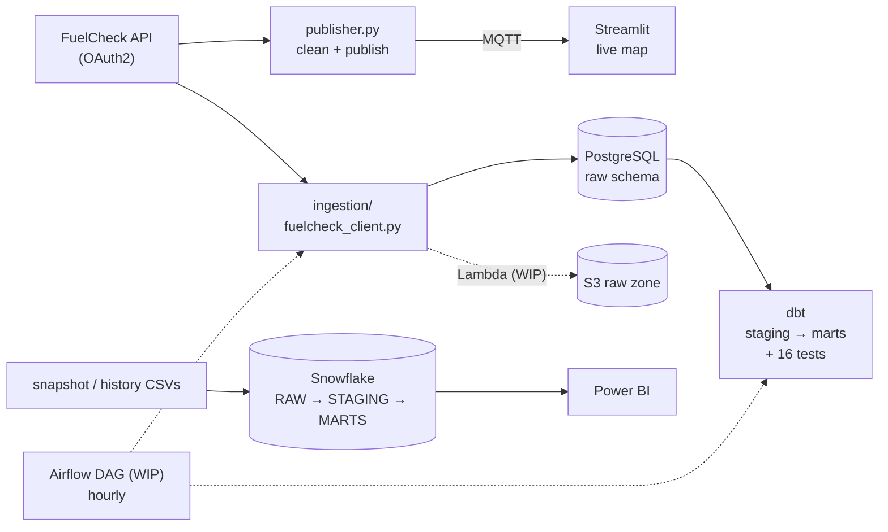

# NSW Fuel Price Data Pipeline

End-to-end data pipeline for live NSW fuel prices. It pulls station and price data from the
NSW Government **FuelCheck API** (OAuth2), cleans it, streams it over **MQTT** to a real-time
**Streamlit** map, and lands it in a warehouse (**PostgreSQL** locally, **Snowflake** in the
cloud) with **dbt** models, data-quality tests and a **Power BI** dashboard on top.

It started as a two-stage university project built by a team of five (COMP5339, University of
Sydney, 2025). The warehouse, transformation, orchestration and cloud layers are my own
extension, built in 2026 and still in progress.



## Status

| Layer | Folder | Status |
|---|---|---|
| Batch collection + cleaning (course, team) | `stage1-data-collection/` | Done |
| Real-time MQTT stream + Streamlit dashboard (course, team) | `stage2-realtime-pipeline/` | Done |
| PostgreSQL warehouse + idempotent loader | `warehouse/postgres/`, `docker-compose.yml` | Done, tested |
| dbt models (staging → star schema) + data tests | `dbt/fuel_dbt/` | Done: 16 data tests pass on the sample snapshot |
| Snowflake warehouse (raw → staging → marts) | `warehouse/snowflake/` | Written, being run on a Snowflake trial |
| Power BI dashboard | `powerbi/` | In progress |
| Airflow orchestration | `orchestration/airflow/` | DAG written, not yet deployed |
| AWS S3 + Lambda ingestion | `cloud/aws/` | Handler unit-tested, not yet deployed |

## Quick start (local warehouse, no API key needed)

Needs Docker Desktop and Python 3.10+.

```bash
pip install -r requirements.txt
cp .env.example .env                                   # local Postgres settings
docker compose up -d                                   # Postgres 16 + Mosquitto MQTT broker

python warehouse/postgres/load_snapshot.py             # load the repo sample (10,432 rows); re-running is a no-op

cd dbt/fuel_dbt
cp profiles.yml.example profiles.yml
dbt build --profiles-dir .                             # seed + models + tests
```

Then query `marts.fct_current_price`, `marts.dim_station`, `marts.dim_fuel_type` and `marts.dq_summary`.

With FuelCheck credentials in `stage2-realtime-pipeline/.env` you can load a live pull instead:
`python warehouse/postgres/load_snapshot.py --live`.

## The pieces

**Stage 1: batch pipeline** (`stage1-data-collection/`). Authenticates against the FuelCheck API,
retrieves station and price data, merges it with a supplementary petrol-station dataset, cleans it and
stores it for analysis (DuckDB in the course version).

**Stage 2: real-time pipeline** (`stage2-realtime-pipeline/`)
- `src/publisher.py` polls the API, cleans each batch and publishes it to an MQTT topic.
- `src/dashboard.py` subscribes to the topic and renders an auto-refreshing Streamlit map of live prices.
- `sample-data/` holds a real snapshot (late May 2025) so everything can be demoed without an API key.

**Warehouse: PostgreSQL** (`warehouse/postgres/`). The raw landing tables keep every column as text,
so a malformed value never blocks a load. The loader uses `COPY` and records every file or API pull
in `raw.load_log`, so re-runs don't duplicate data.

**Transformation: dbt** (`dbt/fuel_dbt/`)
- `stg_api_prices` types and cleans the data (safe casts, suburb/postcode parsed from the address) and keeps
  the newest price per station and fuel. Bad rows are **labelled** in a `dq_issue` column, not silently dropped.
- Marts: `dim_station`, `dim_fuel_type` (seeded, with an `is_liquid_fuel` flag so EV charging stays out of
  c/L averages), `fct_current_price` (staleness and placeholder-price flags) and `dq_summary`.
- Tests: unique / not-null keys, relationships, accepted values, plus custom tests for grain, price range,
  and "no rows lost" (every staged row is in the fact table or counted as excluded).

**Warehouse: Snowflake + Power BI** (`warehouse/snowflake/`, `powerbi/`). The same raw → staging → marts
design in Snowflake (stage + `COPY INTO`, read-only BI role with token auth), plus the monthly
price-history tables for trend analysis. See [`warehouse/README.md`](warehouse/README.md).

**Orchestration and cloud (work in progress).** An hourly Airflow DAG (extract → load → `dbt build`) replaces
the `while True: sleep(60)` loop. An AWS SAM template deploys a Lambda that lands raw JSON in a private S3
bucket, with credentials from Secrets Manager.

## What the data shows (sample snapshot)

- 10,432 price rows, 3,093 stations, 37 brands, 10 fuel types. All rows pass the cleaning rules.
- 758 rows are EV charging, almost all priced at 0, so they are excluded from c/L averages.
- About 13% of liquid-fuel prices hadn't been updated for 30+ days (mostly LPG and E85).
- 2 stations report the same price on 3+ fuel types at the same second, flagged as likely placeholders.
- Name + postcode is not unique (95 combinations map to more than one station), so stations are keyed on the API id.

## Tests

```bash
pytest -q                                   # API client + Lambda handler
cd dbt/fuel_dbt && dbt test --profiles-dir .
```

## Security

API credentials are read from `.env` files that are git-ignored (`.env.example` shows the variables). The
cloud template resolves secrets from AWS Secrets Manager at deploy time.

## Team and credits

Course project team (COMP5339, 2025): Adnan Ali, Akarsh Kumar, Akshat Jain, Annie Shorya, Kevin Ninan Mathew.
The 2026 extension (PostgreSQL, dbt, Snowflake, Power BI, Airflow, AWS) is by Annie Shorya.
Stage reports are in `docs/`.
