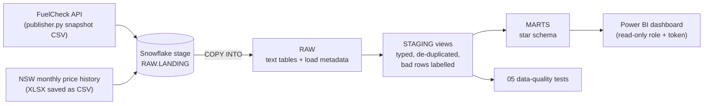

# Warehouse & BI layer — Snowflake + Power BI

**My individual extension (2026)** of the team COMP5339 pipeline in this repo.
The course version stored data in DuckDB (Stage 1) and a JSON file (Stage 2).
This layer moves it into **Snowflake** with a raw → staging → marts design,
automated data-quality tests, and a **Power BI** dashboard on top.

## Run order

| Step | File | What it does |
|---|---|---|
| 1 | `snowflake/01_setup.sql` | XS warehouse (auto-suspend 60s), `FUEL_DB`, schemas `RAW` / `STAGING` / `MARTS` |
| 2 | *Snowsight upload* | Upload CSVs to stage `RAW.LANDING` (see below) |
| 3 | `snowflake/02_load_raw.sql` | File format, stage, raw tables, `COPY INTO` |
| 4 | `snowflake/03_staging.sql` | Typing, cleaning, de-duplication, `dq_issue` labels, history→station matching |
| 5 | `snowflake/04_marts.sql` | Dimensions + facts for Power BI, `DQ_SUMMARY` view |
| 6 | `snowflake/05_data_quality_checks.sql` | Test suite (all should PASS) + findings |
| 7 | `snowflake/06_powerbi_access.sql` | `BI_READER` role + programmatic access token for Power BI |

Re-run steps 3 → 6 whenever new files are added. `COPY INTO` skips files it has already loaded.

## Setup

1. **Snowflake trial** — sign up at signup.snowflake.com (30 days, no credit card).
   Choose **AWS** and **Asia Pacific (Sydney)**.
2. In Snowsight open a SQL worksheet, paste `01_setup.sql`, run all.
3. Run Part A of `02_load_raw.sql` (creates the stage), then upload files:
   **Catalog → Database Explorer** (older layout: **Data → Databases**) → `FUEL_DB` → `RAW` → Stages → `LANDING` → **+ Files**
   - Always: `stage2-realtime-pipeline/sample-data/fuelPrice_data.csv`
   - Optional (for the trends page): 2–3 recent months from the NSW FuelCheck dataset on data.nsw.gov.au.
     Open each XLSX in Excel → make sure row 1 is the header row → format the `PriceUpdatedDate`
     column as `yyyy-mm-dd hh:mm:ss` → **Save As → CSV UTF-8** with a lower-case name like
     `fuelcheck_pricehistory_aug2025.csv`. Expected columns, in this order:
     `ServiceStationName, Address, Suburb, Postcode, Brand, FuelCode, PriceUpdatedDate, Price`.
4. Run Parts B and C of `02_load_raw.sql`, then `03`, `04`, `05`, `06` in order.
5. Build the dashboard: see [`../powerbi/README.md`](../powerbi/README.md).

## Data model (MARTS)

| Table | Grain | Source |
|---|---|---|
| `DIM_STATION` | one row per station (API station id; `H-…` for history-only stations) | API snapshot + history |
| `DIM_FUEL_TYPE` | one row per fuel code, with `IS_LIQUID_FUEL` so EV charging stays out of c/L averages | hand-mapped |
| `DIM_DATE` | one row per day | generated |
| `FCT_CURRENT_PRICE` | station × fuel (latest price in the snapshot) | API snapshot |
| `FCT_PRICE_CHANGE` | one row per price change | monthly history |
| `FCT_DAILY_PRICE` | station × fuel × day, last known price carried forward | monthly history |
| `DQ_SUMMARY` (view) | rows passed / excluded, by reason | staging |

## Design decisions

- **Stage + `COPY INTO`, all-text raw tables.** A malformed value never blocks a load; typing happens in staging with `TRY_` functions. `COPY` load metadata stops the same file loading twice.
- **Label, don't drop.** Every staging row carries a `dq_issue` (NULL = good). Marts only take good rows, and the counts of excluded rows are reported rather than lost.
- **Stations keyed on the API's station id.** Name + postcode is not unique — e.g. three different "7-Eleven Blacktown" stations share postcode 2148. History files have no id, so they are matched on name + postcode only when exactly one API station fits; the rest are kept as history-only stations.
- **Daily price table.** The history records *changes*, so a plain average over-weights stations that change price often. `FCT_DAILY_PRICE` carries each station's last price forward to one row per day.
- **Cost + access.** XS warehouse with 60s auto-suspend; Power BI uses a read-only role limited to `MARTS`, authenticated by a token instead of a password.

## What the data showed (repo sample snapshot, pulled late May 2025)

- 10,432 price rows · 3,093 stations · 37 brands · 10 fuel types; no rows failed the cleaning rules.
- 758 rows are **EV charging**, almost all priced 0 — kept, but excluded from c/L averages.
- About 13% of liquid-fuel prices hadn't been updated for 30+ days (LPG and E85 far more often than U91/E10).
- 2 stations reported the **same price on 3+ fuel types at the same second** (e.g. 111.1 c/L on U91, E10, P95 and diesel) — flagged as suspected placeholders.
- 95 name + postcode combinations belong to more than one station, which is why stations are keyed on the API id.

## Improvements over the course version

- Stage 1 ran `drop_duplicates()` on the last monthly file only, not the combined data — de-duplication now happens across all files in staging.
- API credentials moved out of the code into `.env` (see `stage2-realtime-pipeline/.env.example`).

## Next steps

- Port staging/marts to **dbt** models with `unique` / `not_null` / `relationships` tests (dbt Projects on Snowflake).
- Schedule loads (Snowflake Tasks or Airflow) and switch to incremental loads.
- Containerise the publisher with Docker.
